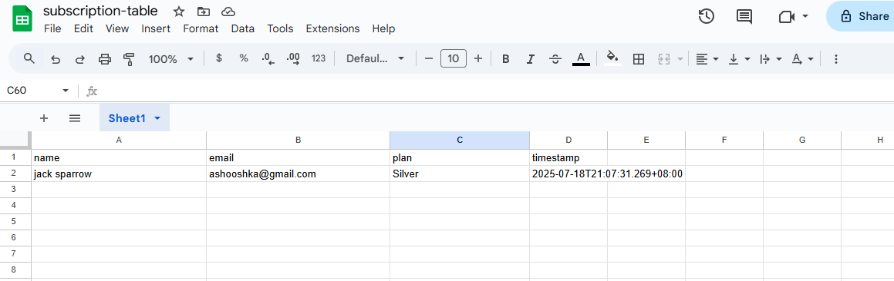
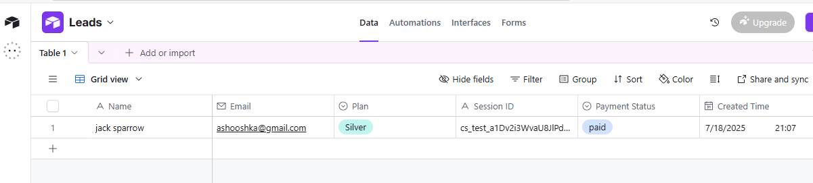
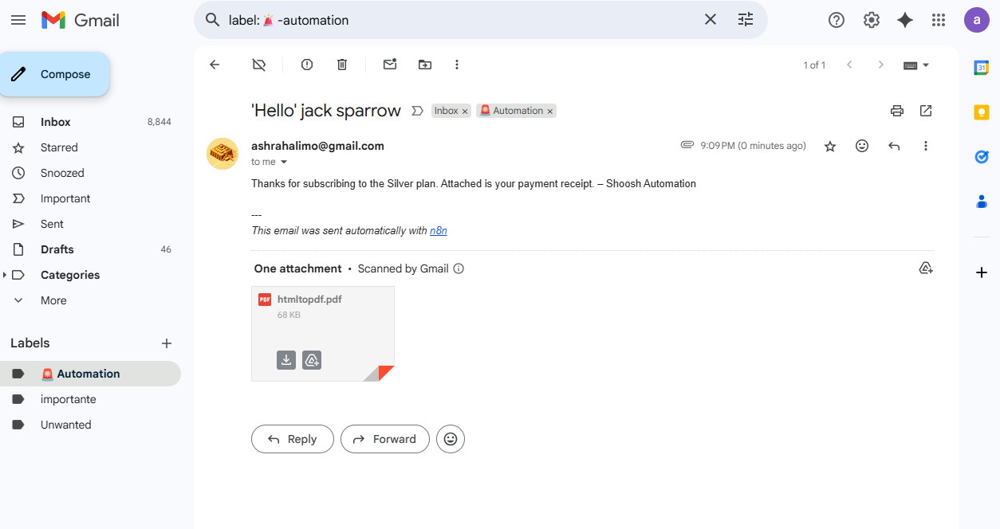
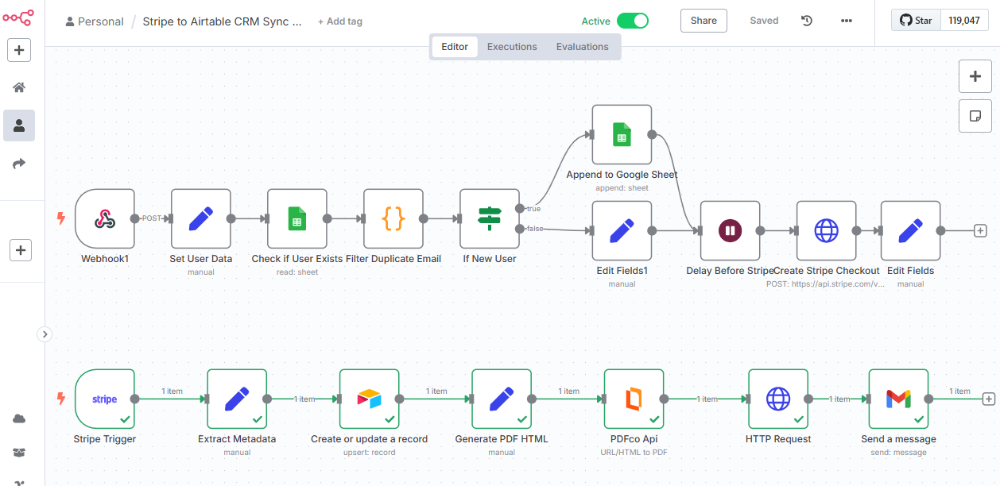

# 🔁 Stripe + Airtable CRM Automation for Subscription Management

A full-featured automation template built with **n8n**, integrating **Stripe Checkout** and **Airtable CRM** to handle:

✅ Payment collection
✅ Plan-based subscription management
✅ Duplicate prevention and logging
✅ CRM sync with auto-update
✅ PDF receipt generation and email delivery

---

## 🎯 Use Case

This automation is perfect for:

* Digital product sellers
* Membership-based platforms
* Subscription plan managers
* CRM-integrated client onboarding

---

## 🛠️ Tech Stack

* [n8n](https://n8n.io/) (Automation platform)
* [Stripe](https://stripe.com/) (Payments)
* [Airtable](https://airtable.com/) (CRM backend)
* [PDF.co](https://pdf.co/) (PDF generation)
* Gmail API (for email delivery)
* Google Sheets (optional logging layer)

---

## 🔧 Workflow Overview

### 📥 Step 1: Lead Registration (HTML Form)

User fills a form with name, email, and plan selection (Basic, Silver, Gold).

### 🔎 Step 2: Duplicate Check

Checks against Google Sheet to prevent duplicate entries.

### 🧾 Step 3: Stripe Checkout

Creates a secure Stripe Checkout Session with metadata (name, email, plan).

### 📬 Step 4: Payment Confirmation (Stripe Webhook)

On `checkout.session.completed`:

* Metadata extracted
* User upserted to Airtable (new or updated record)
* Payment details synced

### 📄 Step 5: Receipt Generation

* Auto-generates PDF receipt using PDF.co
* Sends receipt to user's email

---

## 📊 Airtable Schema

* `Name`
* `Email`
* `Plan`
* `Session ID`
* `Payment Status`
* `Created Time`

Records are matched/updated by `Email` field to keep CRM clean.

---

## 📦 Features

* 🔐 **Metadata integrity**: plan, email, name passed securely to Stripe
* 🚫 **Duplicate prevention** via Google Sheets logic
* 🔁 **Upsert CRM** logic (create or update by email)
* 🧾 **HTML-to-PDF receipt** using clean template
* 📤 **Email receipts** via Gmail OAuth2
* 🧠 **Extendable**: Can support auto-renewal, login dashboards, usage tracking

---

## ▶️ Demo

📽️ *Str-demo.mp4

Give it a try here:
https://shooshka133.github.io/Stripe-Airtable-CRM-Automation-for-Subscription-Management/
---

## 🖼️ Screenshots

| Google Sheets | Airtable | Gmail/PDF | n8n Workflow |
|---------------|----------|--------|--------------|
|  |  |  |  |

---

## 🚀 How to Use

1. 🔧 **Set up Airtable** base + table with the schema above
2. ⚙️ **Import both n8n workflows** (form → payment and webhook → CRM sync)
3. 🔑 **Configure credentials** in n8n:

   * Google Sheets OAuth2
   * Gmail OAuth2
   * Airtable Personal Access Token
   * Stripe API key
   * PDF.co API key
4. 🔗 **Embed or host the signup form** (or trigger via API/Webhook)
5. 🧪 **Test the flow end-to-end**

---

## 📌 Future Enhancements

* 🔐 Secure login + PDF download counter per plan
* 📆 Auto-renewal via Stripe Subscriptions
* 📊 Customer dashboard with plan status
* 🧠 AI usage assistant (e.g., chatbot for CRM insight)

---

## 👤 Author

**Ashraf Abd Elhalim**
Automation Developer | No-Code Expert | Upwork/GitHub Freelancer

---

## 🪪 License

MIT License - use freely for commercial or personal projects.

---

## ⭐ If You Like This Project

Give it a ⭐ on GitHub — it helps others find it too!
